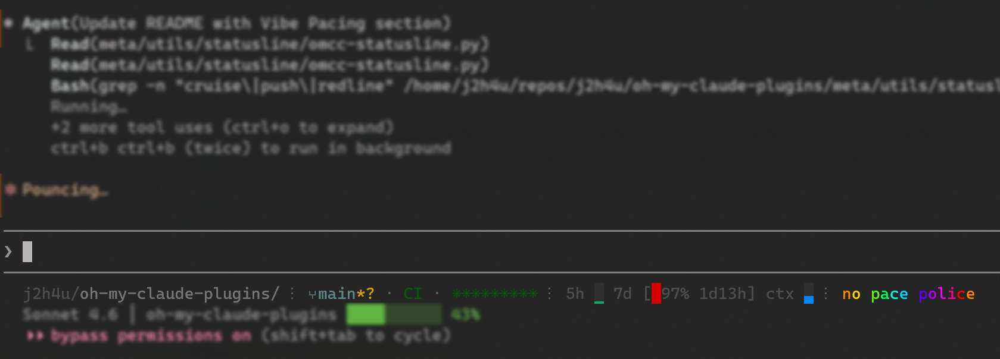

# Oh My Claude Plugins

**Curated collection of Claude Code plugins for everyday development.**

Skills, agents, and hooks that make Claude Code smarter about your workflow — from coding standards to git automation.

[](https://github.com/j2h4u/oh-my-claude-plugins/stargazers)
[](https://opensource.org/licenses/MIT)
[](https://github.com/j2h4u/oh-my-claude-plugins/actions/workflows/validate-plugins.yml)


*[omcc-statusline](meta/utils/statusline/README.md) — Claude Code statusline with git indicators (branch, CI, PRs, msgs), API usage and vibe pacing.*

## Quick Start

```bash
# Add marketplace
/plugin marketplace add j2h4u/oh-my-claude-plugins

# Install what you need
/plugin install coding-standards@oh-my-claude-plugins
```

Or browse interactively: `/plugin` → `Browse and install plugins` → `oh-my-claude-plugins`

## Repository Structure

```
oh-my-claude-plugins/
├── .claude-plugin/
│   ├── marketplace.json          # Marketplace metadata
│   └── plugin.json               # Plugin registry
├── agents/                       # Custom agents
│   ├── plugin.json
│   ├── python-code-reviewer/
│   ├── python-quick-fixer/
│   └── quick-worker/
├── claude-code-meta/             # Claude Code tooling
│   ├── plugin.json
│   └── skills/
│       ├── claude-md-redirect/
│       ├── claude-md-writer/
│       ├── cli-skill-creator/
│       ├── mcp-builder/
│       └── opencode-config/
├── coding-standards/             # Code quality plugins
│   ├── plugin.json
│   └── skills/
│       ├── dignified-bash/
│       ├── dignified-python/
│       ├── kaizen/
│       └── software-architecture/
├── databases/                    # Database tools
│   ├── plugin.json
│   └── skills/
│       └── metabase-swiss-knife/
├── devops/                       # System administration
│   ├── plugin.json
│   └── skills/
│       └── linux-sysadmin/
├── docs/                         # Documentation (plugin + official guides)
│   ├── plugin.json
│   ├── skills/                   # Documentation creation skills
│   │   ├── doc-coauthoring/
│   │   └── readme-generator/
│   ├── plugins.md                # Official Claude Code documentation
│   ├── hooks.md
│   └── plugin-development/
├── git-tools/                    # Git workflow plugins
│   ├── plugin.json
│   └── skills/
│       ├── changelog-generator/
│       ├── gh/
│       └── git-workflow-manager/
├── productivity/                 # Analysis tools
│   ├── plugin.json
│   └── skills/
│       └── meeting-insights-analyzer/
├── statusline/                   # Utility: custom statusline
│   └── agents/
│       └── statusline-setup/
└── web-dev/                      # Frontend development
    ├── plugin.json
    └── skills/
        ├── vercel-react-best-practices/
        ├── web-artifacts-builder/
        └── web-design-guidelines/
```

Each plugin directory contains:
- `plugin.json` — Plugin manifest
- `skills/` — Skill directories with SKILL.md
- `agents/` — Agent directories (where applicable)
- `references/`, `examples/` — Supporting content (in skill dirs)

## Available Plugins

### coding-standards

Code quality and development philosophy.

| Skill | Description | Quality |
|-------|-------------|---------|
| dignified-bash | Strict mode, shellcheck, defensive patterns | ⭐⭐⭐⭐ |
| dignified-python | LBYL philosophy, version-aware (3.10-3.13), Click CLI | ⭐⭐⭐⭐⭐ |
| kaizen | Continuous improvement, poka-yoke, YAGNI | ⭐⭐⭐⭐⭐ |
| software-architecture | Clean Architecture & DDD principles | ⭐⭐ |

### git-tools

Git workflows and GitHub integration.

| Skill | Description | Quality |
|-------|-------------|---------|
| changelog-generator | Transform commits into user-friendly changelogs | ⭐⭐⭐ |
| gh | PR management, GraphQL API, Projects V2 | ⭐⭐⭐⭐⭐ |
| git-workflow-manager | Conventional commits, semantic versioning | ⭐⭐⭐ |

### web-dev

Frontend development.

| Skill | Description | Quality |
|-------|-------------|---------|
| vercel-react-best-practices | 45 performance rules: waterfalls, bundles, SSR | ⭐⭐⭐⭐ |
| web-artifacts-builder | Build React artifacts for Claude.ai | ⭐⭐ |
| web-design-guidelines | Vercel Web Interface Guidelines | ⭐⭐ |

### docs

Documentation creation.

| Skill | Description | Quality |
|-------|-------------|---------|
| doc-coauthoring | Collaborative workflow: gathering, refinement, reader testing | ⭐⭐⭐⭐ |
| readme-generator | README best practices by project type | ⭐⭐⭐ |

### devops

System administration.

| Skill | Description | Quality |
|-------|-------------|---------|
| linux-sysadmin | Debian/Ubuntu: systemd, permissions, packages | ⭐⭐⭐⭐ |

### databases

Database tools and management.

| Skill | Description | Quality |
|-------|-------------|---------|
| metabase-swiss-knife | CLI for Metabase: inspect, diag, backup/restore, cards, dashboards | ⭐⭐⭐⭐ |

### claude-code-meta

Claude Code tooling and meta-skills.

| Skill | Description | Quality |
|-------|-------------|---------|
| cli-skill-creator | Meta-skill for creating CLI tool skills | ⭐⭐⭐⭐⭐ |
| mcp-builder | MCP server development: Python, Node.js | ⭐⭐⭐⭐⭐ |
| claude-md-redirect | Redirect to AGENTS.md with PostToolUse hook | ⭐⭐⭐ |
| claude-md-writer | CLAUDE.md best practices: size limits, 3-tier docs | ⭐⭐⭐⭐ |
| opencode-config | Custom providers, model selection | ⭐⭐⭐ |

**Utility:** `statusline` — Custom statusline showing costs & context usage. Install via `@"statusline-setup"` agent.

### productivity

Analysis tools.

| Skill | Description | Quality |
|-------|-------------|---------|
| meeting-insights-analyzer | Communication patterns, speaking ratios | ⭐⭐⭐⭐ |

### agents

Custom agents for code tasks.

| Agent | Triggers | Description |
|-------|----------|-------------|
| python-code-reviewer | "review Python code" | READ-ONLY analysis, creates issue report |
| python-quick-fixer | "fix Python issues" | Batch fixes from issue list |
| quick-worker | "do this task" | Fast executor for mechanical tasks |

---

## Skills by Quality

Quick overview grouped by rating to identify improvement priorities:

### ⭐⭐⭐⭐⭐ Exemplary (5 skills)

Deep insights + original approaches, comprehensive content:

| Skill | Category | What makes it exemplary |
|-------|----------|-------------------------|
| **gh** | git-tools | Deep mental model, original workflow patterns, exemplary progressive disclosure |
| **mcp-builder** | claude-code-meta | Deep best practices, includes working evaluation tools |
| **cli-skill-creator** | claude-code-meta | Highly original meta-skill, systematic CLI introspection approach |
| **dignified-python** | coding-standards | Deep LBYL philosophy, original error-handling approach |
| **kaizen** | coding-standards | Deep principles with original adaptation to code |

### ⭐⭐⭐⭐ High Quality (8 skills)

Good depth, well-structured, production ready:

| Skill | Category | Notes |
|-------|----------|-------|
| **dignified-bash** | coding-standards | Well-structured but standard bash practices |
| **linux-sysadmin** | devops | Useful practices, standard content |
| **metabase-swiss-knife** | databases | Full CLI with backup/restore, zero dependencies |
| **doc-coauthoring** | docs | Good workflow but not particularly deep |
| **claude-md-writer** | claude-code-meta | Good compilation of best practices |
| **meeting-insights-analyzer** | productivity | Original approach to meeting analysis |
| **vercel-react-best-practices** | web-dev | Great structure but just packages Vercel rules |

### ⭐⭐⭐ Solid but Shallow (5 skills)

**⚠️ Candidates for replacement/deepening** — Complete but lacking depth or originality:

| Skill | Category | Why shallow/standard | Replacement strategy |
|-------|----------|----------------------|----------------------|
| **changelog-generator** | git-tools | Just a workflow, not deep | Find deeper changelog philosophy/patterns |
| **git-workflow-manager** | git-tools | Basic conventional commits reference | Find advanced git workflow patterns |
| **opencode-config** | claude-code-meta | Just config reference, shallow | Find deeper OpenCode configuration insights |
| **claude-md-redirect** | claude-code-meta | Utility, very shallow | Consider removing or expanding |
| **readme-generator** | docs | Just process, shallow content | Find README philosophy/patterns beyond basics |

### ⭐⭐ Incomplete (3 skills)

**🚨 Priority for improvement** — Functional but missing critical content:

| Skill | Category | What's missing | Search for |
|-------|----------|----------------|------------|
| **software-architecture** | coding-standards | Needs examples, library guide | Code pattern examples, library-first guides |
| **web-artifacts-builder** | web-dev | Needs troubleshooting guide, component patterns, examples | React artifact patterns, debugging guides |
| **web-design-guidelines** | web-dev | Needs expansion (176→1500 words), sample output examples | UI/UX guidelines, review examples |

---

### Quality Rating

Quality is rated on **four dimensions**:

1. **Structure** — Progressive disclosure, references/, examples/, clear organization
2. **Completeness** — All sections present, no missing content
3. **Depth** — Insights beyond surface level, practical patterns, deep understanding
4. **Originality** — Unique approach or just packaging existing docs/tools

| Stars | Meaning | Examples |
|-------|---------|----------|
| ⭐⭐⭐⭐⭐ | Exemplary — deep + original + comprehensive | gh (mental model), mcp-builder (evaluation tools), kaizen (code adaptation) |
| ⭐⭐⭐⭐ | High quality — good depth + well-structured | dignified-bash, linux-sysadmin, meeting-insights-analyzer |
| ⭐⭐⭐ | Solid — complete but shallow/standard | changelog-generator (just workflow), opencode-config (config reference) |
| ⭐⭐ | Incomplete — needs expansion or examples | software-architecture, web-artifacts-builder, web-design-guidelines |

**Why downgraded from 5→3 stars?**
- Just a workflow without deep insights (changelog-generator)
- Simple reference/config guide (git-workflow-manager, opencode-config)
- Packaging existing docs without original approach (vercel-react-best-practices)
- Utility skill without depth (claude-md-redirect)

Check **Notes** column for specifics. See [SKILLS-REVIEW-REPORT.md](SKILLS-REVIEW-REPORT.md) for detailed improvement roadmap.

## Alternative Installation

Use as local plugin directory (development mode):

```bash
claude --plugin-dir /path/to/oh-my-claude-plugins
```

## Documentation

### Plugin System Guides (`docs/`)

Comprehensive documentation for Claude Code plugin development:

| Guide | Description |
|-------|-------------|
| [Plugins](docs/plugins.md) | Plugin development quickstart |
| [Plugins Reference](docs/plugins-reference.md) | Technical specifications and schemas |
| [Plugin Marketplaces](docs/plugin-marketplaces.md) | Marketplace creation and management |
| [Hooks](docs/hooks.md) | Event-driven automation (27KB reference) |
| [Skills](docs/skills.md) | Agent skills development |
| [Sub-Agents](docs/sub-agents.md) | Specialized AI assistants |
| [Slash Commands](docs/slash-commands.md) | Command system reference |
| [Settings](docs/settings.md) | Configuration guide (46KB) |

### Plugin Development Resources (`docs/plugin-development/`)

Advanced guides for plugin developers:

| Resource | Description |
|----------|-------------|
| [Schemas](docs/plugin-development/schemas/) | Complete schemas for plugin.json, hooks, marketplace (1,479 lines) |
| [Best Practices](docs/plugin-development/best-practices/) | Organization, naming conventions, common mistakes (1,156 lines) |
| [Templates](docs/plugin-development/templates/) | Ready-to-use templates for all plugin components |
| [Examples](docs/plugin-development/examples/) | Complete plugin walkthrough and testing workflow |

### Skill Quality & Improvement Roadmap

Quality indicators are shown in the skill tables above. For detailed analysis including:
- Specific issues and recommended fixes
- Missing content (examples, troubleshooting guides)
- Word count analysis and expansion needs
- Priority-ordered improvement roadmap

See [SKILLS-REVIEW-REPORT.md](SKILLS-REVIEW-REPORT.md) — comprehensive review of all 19 skills with actionable improvement suggestions.

## Requirements

- Claude Code CLI
- Git (for version control features)

## Contributing

Plugin validation runs automatically on every push via GitHub Actions. To validate locally:

```bash
# Check JSON syntax
jq empty .claude-plugin/marketplace.json

# Validate plugin structure
bash .github/workflows/validate-plugins.yml
```

## Acknowledgments

Inspired by [Claude Code Plugin Template](https://github.com/ivan-magda/claude-code-plugin-template) by Ivan Magda. Plugin development documentation (schemas, best practices, templates) adapted from the template's plugin-authoring skill.

## License

Individual items may have their own licenses. Check each directory.
