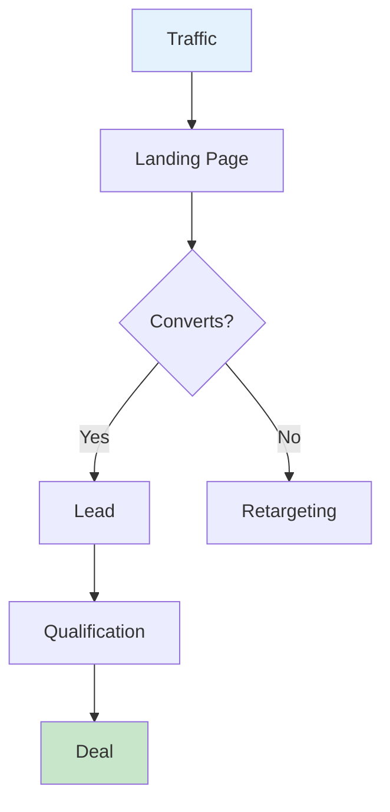
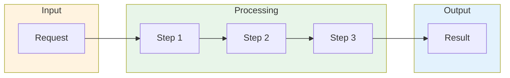
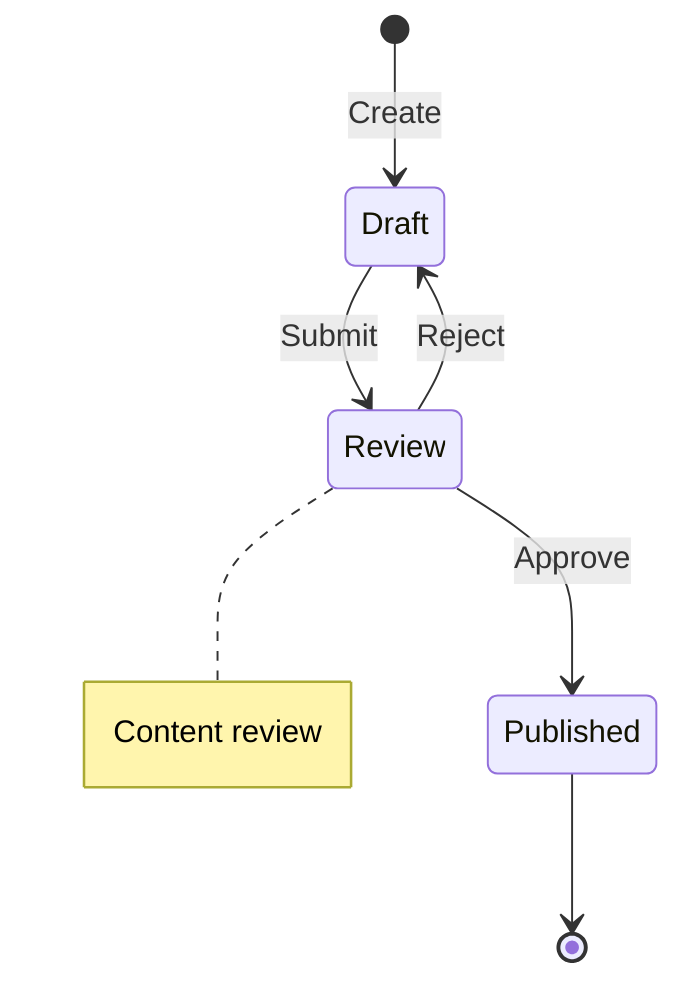
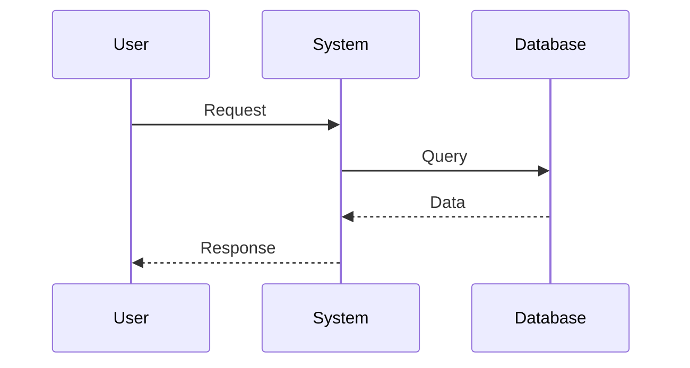

# Mermaid Best Practices

Rules for creating Mermaid diagrams that render correctly across Obsidian, GitHub, and standard markdown renderers.

**Core principle:** Always quote node text. Use stable diagram types. Test before committing.

## When to Use

- Creating any Mermaid diagrams in markdown files
- Generating visual artifacts (funnels, processes, architecture)
- Fixing broken or non-rendering diagrams
- Choosing the right diagram type for a use case

## Critical Rules

### 1. Always Quote Node Text

**Always** wrap node text in double quotes when it contains:
- Non-ASCII characters (Cyrillic, CJK, accented letters)
- Spaces
- Special characters (parentheses, periods, commas)
- Leading digits

```mermaid
%% WRONG
flowchart TD
    A[Market Analysis] --> B[Pick a Niche]

%% CORRECT
flowchart TD
    A["Market Analysis"] --> B["Pick a Niche"]
```

**Safe default:** Quote everything. There is zero downside.

### 2. Avoid Parentheses Inside Nodes

Parentheses `()` conflict with node shape syntax and cause parse failures.

```mermaid
%% WRONG — parser confuses shape delimiters with text
A(["Step 1 (important)"])

%% CORRECT — use dashes or remove parens
A(["Step 1 — important"])
```

### 3. Node Shapes

| Syntax | Shape | Example |
|--------|-------|---------|
| `A["text"]` | Rectangle | `A["Analysis"]` |
| `A("text")` | Rounded | `A("Decision")` |
| `A{"text"}` | Diamond (decision) | `A{"Condition?"}` |
| `A(["text"])` | Stadium | `A(["Start"])` |
| `A[["text"]]` | Subroutine | `A[["Subprocess"]]` |
| `A[("text")]` | Cylinder (DB) | `A[("Database")]` |
| `A(("text"))` | Circle | `A(("Endpoint"))` |

### 4. Subgraph Titles Must Be Quoted

Subgraph labels with spaces or special characters **must** use the `ID["Title"]` form:

```mermaid
%% WRONG
subgraph Data Preparation
    A --> B
end

%% CORRECT
subgraph PREP["Data Preparation"]
    A --> B
end
```

### 5. Arrow Types

| Syntax | Meaning |
|--------|---------|
| `-->` | Arrow |
| `---` | Line (no arrowhead) |
| `-.->` | Dashed arrow |
| `==>` | Thick arrow |
| `--"label"-->` | Arrow with label |

```mermaid
%% Labels on arrows — quote if non-ASCII or spaces
A -->|"Yes"| B
A -->|"No"| C
```

## Diagram Types

### Stable (recommended)

| Type | Use Case |
|------|----------|
| `flowchart TD/LR` | Processes, funnels, workflows |
| `sequenceDiagram` | Interactions, API flows |
| `stateDiagram-v2` | State machines |
| `gantt` | Timelines, project plans |
| `graph TD/LR` | Simple graphs |
| `classDiagram` | UML class diagrams |
| `erDiagram` | Entity-relationship |

### Experimental (use with caution)

| Type | Issues |
|------|--------|
| `quadrantChart` | May fail in older renderers |
| `mindmap` | Limited support |
| `timeline` | Unstable rendering |
| `pie` | Label encoding issues with non-ASCII |

**Tip:** For SWOT analysis, use `flowchart` with `subgraph` instead of `quadrantChart`.

## Templates

### Sales Funnel



### Workflow



### State Machine



### Sequence Diagram



## Pre-Commit Checklist

- All node text with non-ASCII characters is quoted
- Subgraph titles use `ID["Title"]` form
- No raw parentheses inside node text
- Arrow labels are quoted
- Using a stable diagram type
- Tested in target renderer (Obsidian preview / GitHub)

## Troubleshooting

### "Unsupported markdown: list"

**Cause:** Markdown syntax (lists, headers) leaked into the mermaid code block.
**Fix:** Ensure all content inside the block is valid Mermaid syntax only.

### Diagram Not Rendering

1. Check quotes around non-ASCII text
2. Check `subgraph` ... `end` pairing
3. Check arrow syntax
4. Simplify the diagram to isolate the issue

### Shows Raw Code Instead of Diagram

**Cause:** Outdated renderer or missing Mermaid plugin.
**Fix:** Update Obsidian / ensure GitHub has Mermaid support enabled.
